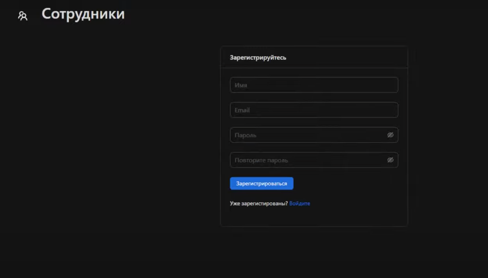
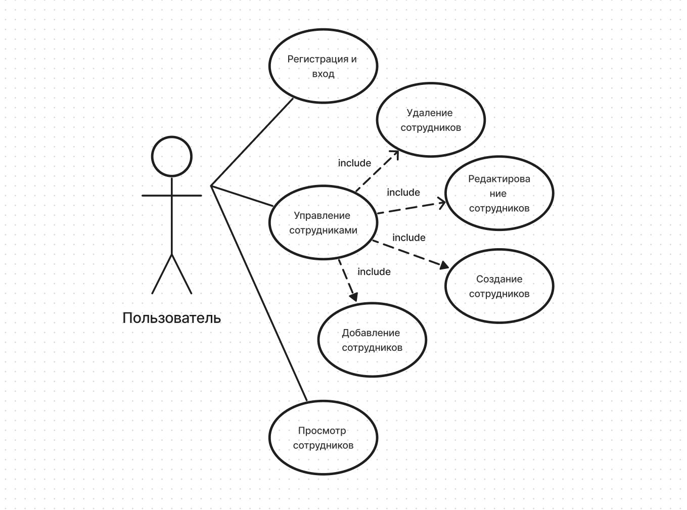
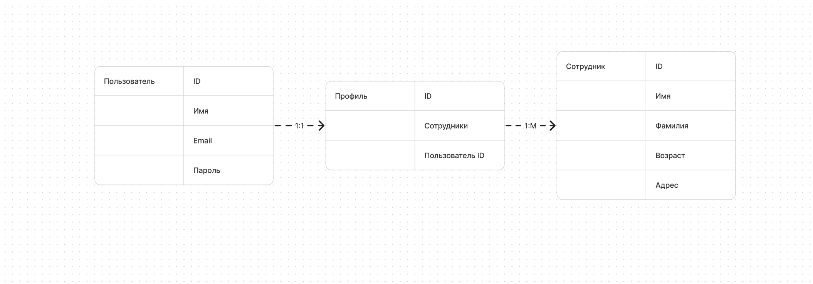

# Приложение "Сотрудники"

Стек:
React, TypeScript, Redux Toolkit, Express

Страница входа:
При запуске приложения нас встречает страница входа. При наличии аккаунта, можно в него зайти, иначе, есть возможность зарегестрироваться.

Страница регистрации:
При регистрации обязательно учитывается формат ввода email-а, он должен содержать знак "@". Поля ввода пароля должны совпадать, длина пароля не должна быть менее 6 символов.

Страница добавления сотрудника:
На странице добавления сотрудника можно добавить сотрудника, либо просмотреть уже имеющихся.

Страница редактирования/удаления сотрудника:
Собственно добавленных сотрудников можно редактировать или удалять.

Страница успешного добавления сотрудника:
В случае успеха вылезает соответвующая плашка.

Usecase:

ERD:

